# 📊 Dashboard de Ventas Avanzado & Gestión CRUD 🚀

✨ **¡Bienvenido/a al Dashboard de Ventas Avanzado y Sistema de Gestión!** Este proyecto es mucho más que una simple colección de gráficos y tablas interactivas. Es una demostración práctica de cómo transformar datos crudos de ventas en **conocimiento accionable** 💡, diseñado no solo para impulsar decisiones de negocio inteligentes, sino también para ilustrar el poder de dominar las **tecnologías fundamentales** de la programación y el análisis de datos.

---

## 🌱 Más Allá de la Superficie: El Valor de los Fundamentos

En un mundo lleno de frameworks y herramientas que prometen resultados rápidos, a menudo olvidamos la importancia crucial de entender **cómo funcionan las cosas bajo el capó**. Este proyecto abraza esa filosofía. Antes de saltar a abstracciones como React, Angular, Vue o complejos ORMs, es **fundamental** construir una base sólida con las tecnologías esenciales:

*   **HTML 🏗️:** El esqueleto semántico de la web. Entenderlo bien es clave para la estructura y la accesibilidad.
*   **CSS 💅:** El arte de la presentación visual. Dominar CSS permite crear interfaces atractivas, responsivas y personalizadas (¡como nuestro modo oscuro! 🌓).
*   **JavaScript Puro (Vanilla JS) 🧠:** El lenguaje del navegador. Aprenderlo sin depender inicialmente de frameworks te da un **poder y una comprensión invaluables** sobre cómo la web realmente cobra vida, cómo manipular el DOM, manejar eventos y gestionar el estado de forma eficiente.
*   **SQL y Bases de Datos Relacionales 💾:** ¡El corazón de casi cualquier aplicación significativa! Saber **diseñar esquemas, escribir consultas eficientes (`SELECT`, `JOIN`, etc.) y realizar operaciones CRUD (Crear, Leer, Actualizar, Eliminar)** directamente sobre la base de datos es una habilidad **absolutamente esencial** para cualquier desarrollador que trabaje con datos.

Dominar estos pilares no solo te hace un mejor programador, sino que te prepara para **aprender y adaptar cualquier framework o tecnología nueva** mucho más rápido y con mayor profundidad.

## 🤝 Uniendo Mundos: Desarrollo + Análisis de Datos = ✨ Superpoderes ✨

Este proyecto se sitúa en la **intersección emocionante del desarrollo de software y el análisis de datos**. Aprender tecnologías transversales como SQL, JavaScript (que se usa tanto en frontend como en backend con Node.js) y entender cómo fluyen los datos desde la base de datos hasta una visualización interactiva, te abre puertas increíbles 🚪.

Como desarrollador con mentalidad analítica (o analista con habilidades de desarrollo), puedes:

*   **Crear Soluciones Enfocadas al Negocio:** Entender *qué* datos son importantes y *cómo* presentarlos para que tengan sentido para la toma de decisiones.
*   **Definir y Construir KPIs Significativos:** Ir más allá de mostrar números y crear indicadores clave de rendimiento que realmente midan la salud del negocio.
*   **Generar Insights Accionables:** Descubrir patrones, tendencias y anomalías en los datos que pueden pasar desapercibidos en informes estáticos.
*   **Construir Herramientas Integradas:** Desarrollar soluciones completas, desde la captura y almacenamiento del dato hasta su análisis y visualización, como este mismo dashboard.

Las empresas **valoran enormemente** este perfil híbrido 💼💰, ya que puedes traducir las necesidades del negocio en soluciones técnicas efectivas y, a la vez, extraer valor real de los datos generados.

## 🎯 El Propósito de Este Proyecto: Pensar Fuera de la Caja 📦

He construido este proyecto con la intención de **plasmar y compartir habilidades** que a menudo no se enfatizan lo suficiente en la educación formal: la importancia de los fundamentos, la conexión directa con la base de datos, y la sinergia entre el código y el análisis.

Este repositorio está dedicado a mis estudiantes y al público en general como una invitación a:

1.  **Ver más allá:** Comprender cómo se conectan las piezas de una aplicación full-stack.
2.  **Aprender los Fundamentos:** Valorar y practicar con HTML, CSS, JS puro y SQL antes (o junto con) herramientas más abstractas.
3.  **Pensar fuera de la caja:** Darse cuenta de que se pueden construir aplicaciones potentes y significativas dominando las bases.

Sí, existen **frameworks asombrosos** y **tecnologías que facilitan enormemente** el desarrollo. Herramientas como **Python** (con Pandas, Matplotlib, etc.), **Power BI**, Tableau, o incluso **Excel** son aliados poderosos en el mundo del análisis de datos y la creación de dashboards. Sin embargo, entender el flujo completo en un **entorno integrado** como el que presentamos aquí, controlando desde la consulta SQL hasta el último detalle del CSS y la interacción JS, te da una **perspectiva y unas oportunidades únicas**.

Este proyecto es un ejemplo de cómo puedes **llevar tus habilidades al siguiente nivel**, construyendo no solo *lo que funciona*, sino entendiendo *por qué y cómo funciona*, preparándote para afrontar retos más complejos y aportar un valor diferencial.

**¡Explora el código, experimenta y sigue aprendiendo!** 🚀

---

---

## 🗄️ El Corazón de Datos: La Base de Datos `SUPERMERCADO_JPV_V3` 💾

¡Todo gran sistema necesita una base sólida, y aquí es donde reside la nuestra! La base de datos `SUPERMERCADO_JPV_V3` es el **repositorio central** donde vive toda la información vital de nuestro supermercado.

*   **Tecnología Utilizada:** Hemos elegido **Microsoft SQL Server** 🖥️, un sistema de gestión de bases de datos relacionales robusto y escalable, perfecto para manejar los datos de ventas, productos, clientes y más.

*   **¿Qué Contiene?** Dentro de `SUPERMERCADO_JPV_V3`, la información está organizada lógicamente en **tablas interconectadas** 🔗. Las tablas principales incluyen:
    *   👤 `Clientes`: Información de quienes compran.
    *   📦`Productos`: Catálogo de artículos, precios, stock.
    *   🛒 `Ventas`: El registro detallado de cada transacción.
    *   👷 `Vendedores`: Quién realiza las ventas.
    *   🌍 `Regiones` (y Provincias): Datos geográficos relevantes.
    *   📸 Tablas adicionales para almacenar rutas a fotos de productos y vendedores.
    *   *¡Y más!* (Como Géneros, etc., según el diseño completo).

    Estas tablas se relacionan mediante **claves primarias y foráneas**, asegurando la **integridad referencial** (¡no puedes vender un producto que no existe!) y minimizando la redundancia de datos.

*   **La Conexión Vital:** Nuestro backend (`server.js`) utiliza el driver `mssql` para **conectarse de forma segura** a esta base de datos. Es la fuente de la que bebe la API para:
    *   Alimentar el **Dashboard** 📊 con datos agregados (a través de la vista `NUEVA_VISTA_ANALISIS_VENTAS_v1`) y detallados.
    *   Permitir las operaciones **CRUD** (Crear, Leer, Actualizar, Eliminar) en la sección de **Gestión de Ventas** 📝.

*   **Automatización (Opcional):** El diseño también puede incluir **Triggers** ⚡ para tareas automáticas, como actualizar el stock de `Productos` cada vez que se inserta una nueva `Venta`.

Esta base de datos no es solo almacenamiento; es la **fuente única de verdad** que permite el análisis, la gestión y la toma de decisiones inteligentes para el supermercado. ✅


---


## 🖼️ Vistas del Dashboard y Aplicación

A continuación se muestran algunas capturas de pantalla clave del Dashboard de Ventas y la interfaz de Gestión de Ventas:

| Vista 1                                      | Vista 2                                         | Vista 3                                       |
| :------------------------------------------: | :---------------------------------------------: | :-------------------------------------------: |
| 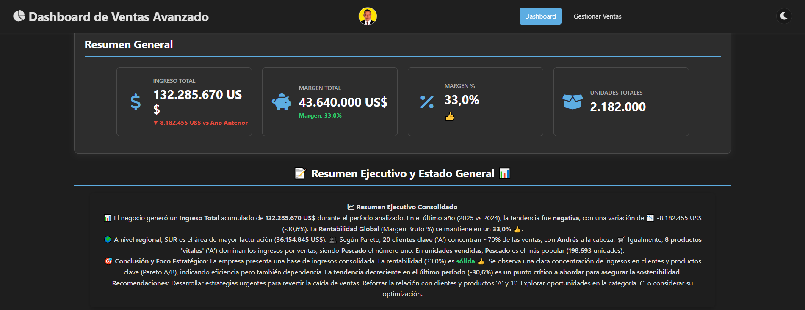 | 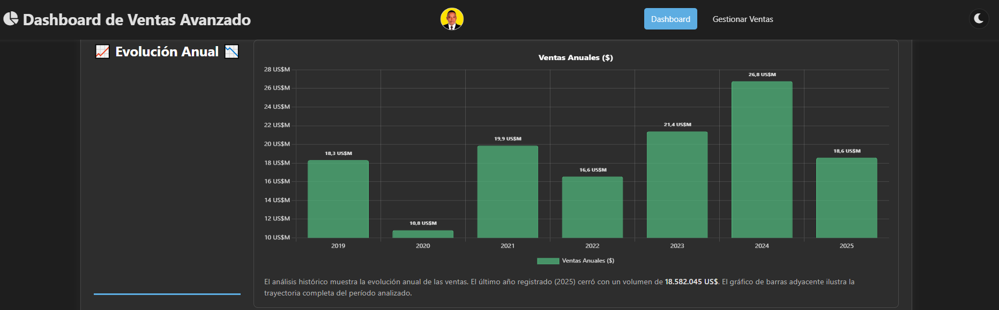 | 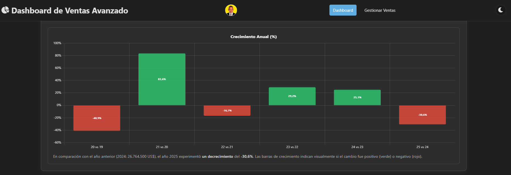 |
| 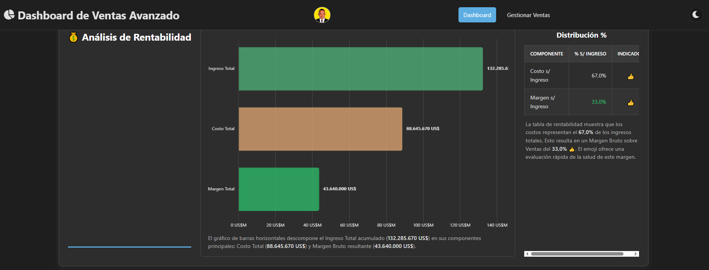 | 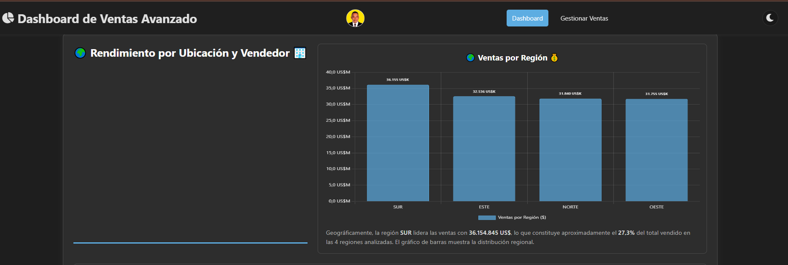 | 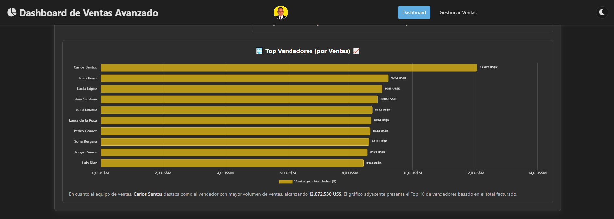 |
|  | 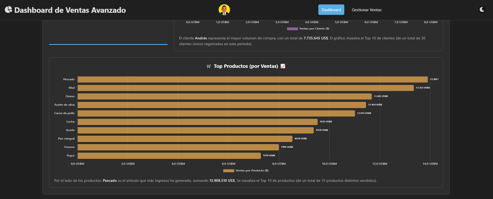 | 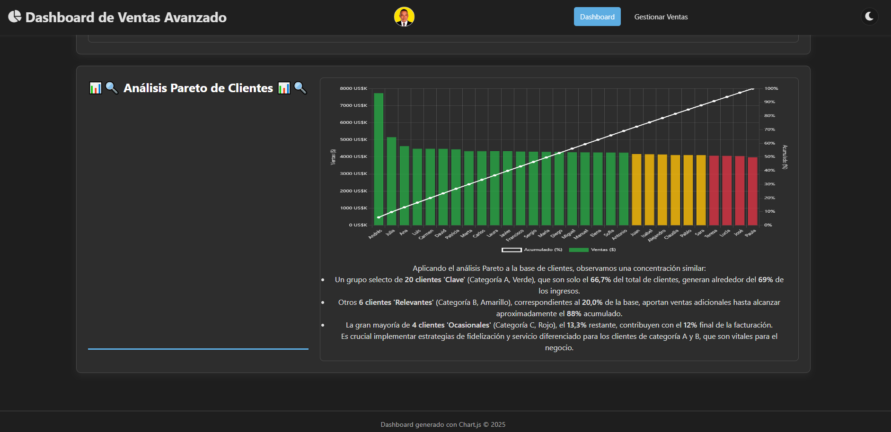 |
| 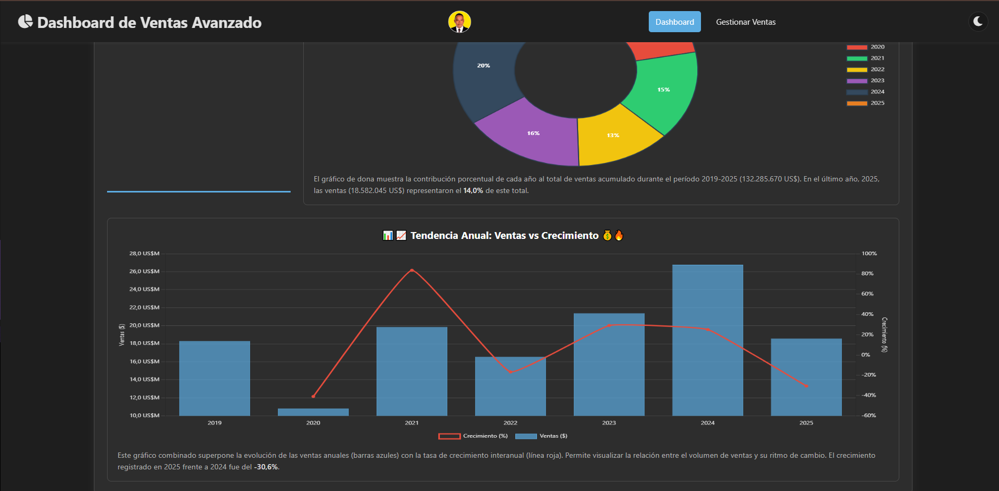 | 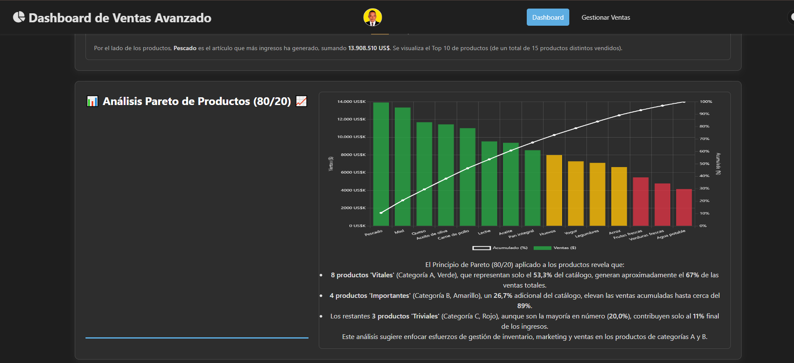 | 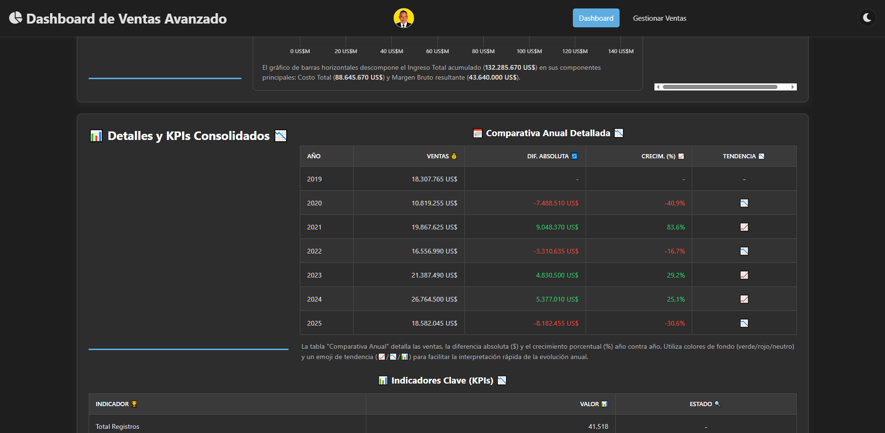 |

## Construyendo la Experiencia: HTML 🏗️, CSS 💅 y JavaScript Puro 🧠

La interfaz que ves es el resultado de la sinergia del trío fundamental de la web:

*   **HTML (`index.html`, `ventas.html`):** Define la **estructura semántica** del contenido. Son los cimientos: las secciones, los títulos, los contenedores para gráficos, las tablas, los formularios y los botones.
*   **CSS (`style.css`, `ventas_style.css`):** Es el **estilista**. Se encarga de toda la apariencia visual: colores, fuentes, espaciado, diseño responsivo (para que funcione en móviles y escritorio) y, por supuesto, ¡el **modo oscuro**! 🌓 Define la personalidad visual de la aplicación.
*   **JavaScript Puro (Vanilla JS - `script.js`, `ventas_script.js`):** Es el **cerebro interactivo**. Este proyecto se enfoca en usar JavaScript directamente (sin frameworks pesados de frontend) para:
    *   Obtener datos de la API del `server.js`.
    *   Manipular el DOM (actualizar KPIs, llenar tablas, etc.).
    *   Gestionar eventos (clics en botones, cambios en formularios).
    *   Realizar cálculos y agregaciones del lado del cliente.
    *   Orquestar la creación y actualización de los gráficos.
    *   Manejar la lógica de paginación y la interacción del formulario CRUD.
    *   Implementar el cambio de tema (modo oscuro).

Usar Vanilla JS nos da un control granular, optimiza el rendimiento y es una excelente base para entender cómo funciona la web bajo el capó.

---

## Potenciando Funcionalidades: Librerías Clave 📚🧱

No reinventamos la rueda. Aprovechamos librerías especializadas para tareas complejas:

*   **Chart.js:** La estrella de la visualización. Permite crear gráficos interactivos y atractivos (barras, líneas, donas, combinados) con relativa facilidad.
*   **Chart.js DataLabels Plugin:** Extiende Chart.js para mostrar valores directamente sobre los gráficos, mejorando la legibilidad inmediata.
*   **jsPDF:** Fundamental para la funcionalidad de **exportación a PDF**. Permite generar documentos PDF directamente en el navegador.
*   **html2canvas:** Trabaja junto a jsPDF. "Toma una foto" de los elementos HTML (como los gráficos y tablas renderizados) para poder incluirlos como imágenes dentro del PDF.
*   **Font Awesome:** Proporciona los iconos  iconography que mejoran la usabilidad y el atractivo visual de la interfaz (botones, KPIs, títulos).

Estas librerías aceleran el desarrollo y proporcionan funcionalidades robustas y probadas.

---

## Del Dato Crudo al Insight Visual: Gráficos y Análisis 📊✨

El verdadero poder surge cuando los datos se transforman en información visual fácil de digerir:

1.  **Recolección:** `server.js` consulta la base de datos (la vista `NUEVA_VISTA_ANALISIS_VENTAS_v1` para el resumen y las tablas unidas para detalles).
2.  **Procesamiento:** `script.js` recibe estos datos. Realiza agregaciones (ventas por región, por vendedor, etc.) y cálculos clave (crecimiento anual, Pareto A/B/C, KPIs).
3.  **Visualización:** Chart.js entra en acción para renderizar:
    *   **KPIs:** Tarjetas de resumen con indicadores clave inmediatos.
    *   **Tendencias:** Gráficos de barras y líneas mostrando la evolución de ventas y crecimiento.
    *   **Distribución:** Gráficos de dona o barras para ver la composición (ventas por región, producto).
    *   **Análisis Pareto:** Gráficos combinados que identifican los elementos vitales (productos/clientes 80/20).
    *   **Tablas:** Presentación detallada y formateada de datos numéricos y comparativos.

Este proceso convierte filas y columnas de números en **patrones, tendencias y anomalías** visualmente evidentes.

---

## Compartiendo el Conocimiento: Generación de PDF 📄📤

Un análisis es útil, pero poder **compartirlo y archivarlo** es crucial. La funcionalidad de exportar a PDF (usando `jsPDF` y `html2canvas`) permite:

*   Crear **informes estáticos** para reuniones o registros.
*   Compartir los insights con stakeholders que no accedan directamente al dashboard.
*   Tener una "foto" del estado del negocio en un momento específico.

Se implementó una lógica cuidadosa (`addBlockEnsuringAtomicity` en `script.js`) para asegurar que cada gráfico y su título se mantengan **juntos en la misma página**, evitando cortes incómodos y mejorando la legibilidad del informe final. ✅

---

## ¿Por Qué Esta Tecnología? Valor para el Negocio 💼💰

La combinación de tecnologías elegida (Node.js, Express, SQL Server, Vanilla JS, Chart.js, etc.) ofrece ventajas significativas para una empresa:

*   **Escalabilidad:** Node.js es conocido por su buen manejo de operaciones concurrentes, ideal para APIs. SQL Server es una base de datos robusta capaz de manejar grandes volúmenes de datos.
*   **Rendimiento:** Una API bien diseñada y un frontend optimizado (Vanilla JS) resultan en una experiencia de usuario fluida.
*   **Control y Flexibilidad:** No depender de frameworks de frontend complejos permite un control total sobre el código y la optimización.
*   **Coste-Efectividad:** Muchas de estas tecnologías son open-source (Node, Express, Chart.js) o tienen ediciones accesibles (SQL Server Express), reduciendo costes de licencia.
*   **Ecosistema Maduro:** Existe una vasta comunidad y documentación para todas estas herramientas.

---

## Impulsando Decisiones: El Poder del Análisis de Ventas 💡🎯

Este dashboard no es solo para "ver" datos, es para **actuar**:

*   **¿Qué productos son los más rentables (Pareto Productos)?** ➡️ Optimizar inventario, enfocar marketing.
*   **¿Qué clientes generan más ingresos (Pareto Clientes)?** ➡️ Implementar programas de fidelización, asignar recursos de ventas.
*   **¿Cómo evolucionan las ventas año a año (Gráficos Anuales)?** ➡️ Identificar tendencias de crecimiento o declive, ajustar estrategias.
*   **¿Qué región o vendedor tiene mejor/peor desempeño?** ➡️ Reasignar territorios, ofrecer capacitación, ajustar incentivos.
*   **¿Cuál es el margen de beneficio general (KPIs)?** ➡️ Evaluar salud financiera, tomar decisiones sobre precios o costos.

Al presentar la información de forma clara y contextualizada, el **análisis de datos se convierte en la brújula** 🧭 que guía la toma de decisiones estratégicas y operativas, permitiendo a la empresa reaccionar rápidamente a las condiciones del mercado y optimizar sus resultados.

---

## Estructura del Proyecto 📁

A continuación se muestra la organización de los archivos y carpetas clave del proyecto:

```text
.
├── node_modules/             # Dependencias de Node.js instaladas
├── public/                   # Archivos estáticos servidos al cliente
│   ├── index.html          # UI del Dashboard Principal
│   ├── style.css           # Estilos Generales y del Dashboard
│   ├── script.js           # Lógica JavaScript del Dashboard
│   ├── ventas.html         # UI de Gestión de Ventas
│   ├── ventas_style.css    # Estilos específicos de Gestión de Ventas
│   └── ventas_script.js    # Lógica JavaScript de Gestión de Ventas
├── .env                      # (Opcional/Recomendado) Variables de entorno (¡Añadir a .gitignore!)
├── server.js                 # Script del Servidor Backend (Node.js/Express)
├── package.json              # Metadatos del proyecto y dependencias npm
├── package-lock.json         # Versiones exactas de las dependencias instaladas
└── README.md                 # Documentación del proyecto (este archivo)

---
## ¡Puesta en Marcha! ▶️⚙️

Para poner en funcionamiento este proyecto en tu entorno local, sigue estos pasos:

### 1. Prerrequisitos 🛠️

Asegúrate de tener instalado el siguiente software en tu sistema:

*   **Node.js y npm:**
    *   **Node.js:** Es el entorno de ejecución para el backend (`server.js`). Se recomienda una versión LTS (Long Term Support) reciente. Puedes descargarlo desde [nodejs.org](https://nodejs.org/).
    *   **npm:** Viene incluido con Node.js. Es el gestor de paquetes que usaremos para instalar las librerías del proyecto. Puedes verificar tu instalación abriendo una terminal y ejecutando `node -v` y `npm -v`.
*   **SQL Server:**
    *   Necesitas una instancia de **Microsoft SQL Server** accesible (puede ser una versión Express gratuita, Developer, Standard, etc.). Esta será la base de datos que almacenará los datos de ventas.
    *   Puedes descargar SQL Server desde el [sitio oficial de Microsoft](https://www.microsoft.com/es-es/sql-server/sql-server-downloads).
    *   **Opcional pero recomendado:** Una herramienta de gestión de bases de datos como **SQL Server Management Studio (SSMS)** o **Azure Data Studio** para crear la base de datos, las tablas y ejecutar consultas fácilmente.

### 2. Configuración de la Base de Datos 🗄️

*   **Crea la Base de Datos:** Usando SSMS o tu herramienta preferida, crea una nueva base de datos llamada `SUPERMERCADO_JPV_V_2025`.
*   **Crea las Tablas y Vistas:** Ejecuta los scripts SQL necesarios para crear las tablas (`CLIENTE`, `VENDEDOR`, `REGION`, `PRODUCTO`, `VENTAS`) y la vista de análisis (`NUEVA_VISTA_ANALISIS_VENTAS_v1`) dentro de la base de datos `SUPERMERCADO_JPV_V_2025`. *(Nota: Asegúrate de tener estos scripts o créalos según la estructura esperada por `server.js`)*.
*   **Configura la Conexión:** Abre el archivo `server.js` en un editor de texto. Localiza la sección `dbConfig` y **modifica los valores** (`user`, `password`, `server`, `database`) para que coincidan con los detalles de tu instancia de SQL Server y tus credenciales. 🔑 **¡IMPORTANTE: No compartas credenciales sensibles en repositorios públicos!** Considera usar variables de entorno (con `dotenv`) para manejar las credenciales de forma más segura si planeas compartir el código.

### 3. Instalación de Dependencias (Node.js) 📦

*   **Clona el Repositorio:** Si aún no lo has hecho, descarga o clona el código fuente del proyecto en tu máquina local.
*   **Instala Librerías:** Abre una terminal o línea de comandos, navega hasta la **carpeta raíz** del proyecto (la que contiene `server.js` y `package.json`) y ejecuta el siguiente comando:
    ```bash
    npm install express mssql cors dotenv
    ```
    Este comando instalará (o actualizará) las librerías de Node.js necesarias para el backend (`server.js`). Las librerías clave incluidas en este comando son:
    *   `express`: Framework web para construir la API y servir los archivos estáticos.
    *   `mssql`: Driver oficial de Microsoft para conectar Node.js con SQL Server.
    *   `cors`: Middleware para habilitar Cross-Origin Resource Sharing (útil si tu frontend se sirve desde un origen diferente al backend en algún momento, aunque en esta configuración simple no sea estrictamente necesario, es buena práctica incluirlo).
    *   `dotenv`: Permite cargar variables de entorno desde un archivo `.env` (ideal para manejar credenciales de base de datos y otras configuraciones sensibles de forma segura, separadas del código fuente).

    *(Nota: Si ya tienes un `package.json`, puedes ejecutar `npm install` y se instalarán todas las dependencias listadas allí, incluyendo estas si están definidas).*

### 4. Variables de Entorno (Opcional, pero Recomendado con `dotenv`) 🔒

*   Si decides usar `dotenv`, crea un archivo llamado `.env` en la **carpeta raíz** del proyecto (al mismo nivel que `server.js`).
*   Dentro del archivo `.env`, define tus variables de entorno, por ejemplo:
    ```dotenv
    DB_USER=tu_usuario_sql
    DB_PASSWORD=tu_contraseña_sql
    DB_SERVER=tu_servidor_sql\\instancia
    DB_DATABASE=SUPERMERCADO_JPV_V_2025
    PORT=3000
    ```
*   **Importante:** Añade el archivo `.env` a tu `.gitignore` para evitar subirlo accidentalmente a repositorios públicos.
*   Asegúrate de que `server.js` cargue y use estas variables (normalmente se añade `require('dotenv').config();` al principio del archivo y se modifican las partes relevantes como `dbConfig` y `port` para usar `process.env.NOMBRE_VARIABLE`).

### 5. Ejecutar el Servidor Backend 🚀

*   Desde la misma terminal en la carpeta raíz del proyecto, ejecuta:
    ```bash
    node server.js
    ```
*   Si todo está configurado correctamente, deberías ver mensajes en la consola indicando que el servidor está escuchando en un puerto (el definido en `.env` o el valor por defecto) y que se ha conectado (o intentado conectar) a la base de datos.

### 6. Acceder a la Aplicación 🌐

*   Abre tu navegador web preferido.
*   Navega a `http://localhost:3000` (o el puerto configurado) para ver el **Dashboard de Ventas**.
*   Navega a `http://localhost:3000/ventas.html` para acceder a la interfaz de **Gestión de Ventas**.

---

¡Explora, analiza y toma decisiones basadas en datos! 🎉
