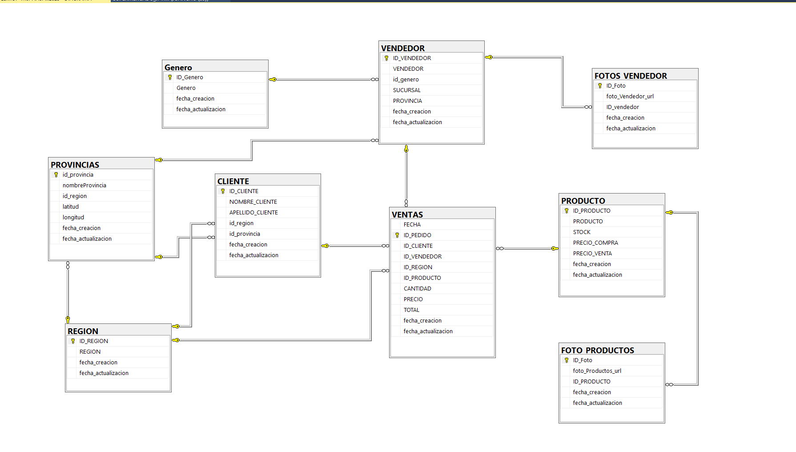
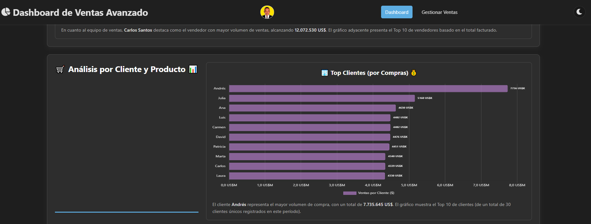

# 📊 Dashboard de Ventas Avanzado & Gestión CRUD 🚀

✨ **¡Bienvenido/a al Dashboard de Ventas Avanzado y Sistema de Gestión!** Este proyecto es mucho más que una simple colección de gráficos y tablas interactivas. Es una demostración práctica de cómo transformar datos crudos de ventas en **conocimiento accionable** 💡, diseñado no solo para impulsar decisiones de negocio inteligentes, sino también para ilustrar el poder de dominar las **tecnologías fundamentales** de la programación y el análisis de datos.

---

## 🌱 Más Allá de la Superficie: El Valor de los Fundamentos

En un mundo lleno de frameworks y herramientas que prometen resultados rápidos, a menudo olvidamos la importancia crucial de entender **cómo funcionan las cosas bajo el capó**. Este proyecto abraza esa filosofía. Antes de saltar a abstracciones como React, Angular, Vue o complejos ORMs, es **fundamental** construir una base sólida con las tecnologías esenciales:

*   **HTML 🏗️:** El esqueleto semántico de la web. Entenderlo bien es clave para la estructura y la accesibilidad.
*   **CSS 💅:** El arte de la presentación visual. Dominar CSS permite crear interfaces atractivas, responsivas y personalizadas (¡como nuestro modo oscuro! 🌓).
*   **JavaScript Puro (Vanilla JS) 🧠:** El lenguaje del navegador. Aprenderlo sin depender inicialmente de frameworks te da un **poder y una comprensión invaluables** sobre cómo la web realmente cobra vida, cómo manipular el DOM, manejar eventos y gestionar el estado de forma eficiente.
*   **SQL y Bases de Datos Relacionales 💾:** ¡El corazón de casi cualquier aplicación significativa! Saber **diseñar esquemas, escribir consultas eficientes (`SELECT`, `JOIN`, etc.) y realizar operaciones CRUD (Crear, Leer, Actualizar, Eliminar)** directamente sobre la base de datos es una habilidad **absolutamente esencial** para cualquier desarrollador que trabaje con datos.

Dominar estos pilares no solo te hace un mejor programador, sino que te prepara para **aprender y adaptar cualquier framework o tecnología nueva** mucho más rápido y con mayor profundidad.

## 🤝 Uniendo Mundos: Desarrollo + Análisis de Datos = ✨ Superpoderes ✨

Este proyecto se sitúa en la **intersección emocionante del desarrollo de software y el análisis de datos**. Aprender tecnologías transversales como SQL, JavaScript (que se usa tanto en frontend como en backend con Node.js) y entender cómo fluyen los datos desde la base de datos hasta una visualización interactiva, te abre puertas increíbles 🚪.

Como desarrollador con mentalidad analítica (o analista con habilidades de desarrollo), puedes:

*   **Crear Soluciones Enfocadas al Negocio:** Entender *qué* datos son importantes y *cómo* presentarlos para que tengan sentido para la toma de decisiones.
*   **Definir y Construir KPIs Significativos:** Ir más allá de mostrar números y crear indicadores clave de rendimiento que realmente midan la salud del negocio.
*   **Generar Insights Accionables:** Descubrir patrones, tendencias y anomalías en los datos que pueden pasar desapercibidos en informes estáticos.
*   **Construir Herramientas Integradas:** Desarrollar soluciones completas, desde la captura y almacenamiento del dato hasta su análisis y visualización, como este mismo dashboard.

Las empresas **valoran enormemente** este perfil híbrido 💼💰, ya que puedes traducir las necesidades del negocio en soluciones técnicas efectivas y, a la vez, extraer valor real de los datos generados.

## 🎯 El Propósito de Este Proyecto: Pensar Fuera de la Caja 📦

He construido este proyecto con la intención de **plasmar y compartir habilidades** que a menudo no se enfatizan lo suficiente en la educación formal: la importancia de los fundamentos, la conexión directa con la base de datos, y la sinergia entre el código y el análisis.

Este repositorio está dedicado a mis estudiantes y al público en general como una invitación a:

1.  **Ver más allá:** Comprender cómo se conectan las piezas de una aplicación full-stack.
2.  **Aprender los Fundamentos:** Valorar y practicar con HTML, CSS, JS puro y SQL antes (o junto con) herramientas más abstractas.
3.  **Pensar fuera de la caja:** Darse cuenta de que se pueden construir aplicaciones potentes y significativas dominando las bases.

Sí, existen **frameworks asombrosos** y **tecnologías que facilitan enormemente** el desarrollo. Herramientas como **Python** (con Pandas, Matplotlib, etc.), **Power BI**, Tableau, o incluso **Excel** son aliados poderosos en el mundo del análisis de datos y la creación de dashboards. Sin embargo, entender el flujo completo en un **entorno integrado** como el que presentamos aquí, controlando desde la consulta SQL hasta el último detalle del CSS y la interacción JS, te da una **perspectiva y unas oportunidades únicas**.

Este proyecto es un ejemplo de cómo puedes **llevar tus habilidades al siguiente nivel**, construyendo no solo *lo que funciona*, sino entendiendo *por qué y cómo funciona*, preparándote para afrontar retos más complejos y aportar un valor diferencial.

**¡Explora el código, experimenta y sigue aprendiendo!** 🚀

---

## 🗄️ El Corazón de Datos: La Base de Datos `SUPERMERCADO_JPV_V3` 💾

¡Todo gran sistema necesita una base sólida, y aquí es donde reside la nuestra! La base de datos `SUPERMERCADO_JPV_V3` es el **repositorio central** donde vive toda la información vital de nuestro supermercado.

*   **Tecnología Utilizada:** Hemos elegido **Microsoft SQL Server** 🖥️, un sistema de gestión de bases de datos relacionales robusto y escalable, perfecto para manejar los datos de ventas, productos, clientes y más.

*   **¿Qué Contiene?** Dentro de `SUPERMERCADO_JPV_V3`, la información está organizada lógicamente en **tablas interconectadas** 🔗. Las tablas principales incluyen:
    *   👤 `Clientes`: Información de quienes compran.
    *   📦`Productos`: Catálogo de artículos, precios, stock.
    *   🛒 `Ventas`: El registro detallado de cada transacción.
    *   👷 `Vendedores`: Quién realiza las ventas.
    *   🌍 `Regiones` (y Provincias): Datos geográficos relevantes.
    *   📸 Tablas adicionales para almacenar rutas a fotos de productos y vendedores.
    *   *¡Y más!* (Como Géneros, etc., según el diseño completo).

    Estas tablas se relacionan mediante **claves primarias y foráneas**, asegurando la **integridad referencial** (¡no puedes vender un producto que no existe!) y minimizando la redundancia de datos.

*   **La Conexión Vital:** Nuestro backend (`server.js`) utiliza el driver `mssql` para **conectarse de forma segura** a esta base de datos. Es la fuente de la que bebe la API para:
    *   Alimentar el **Dashboard** 📊 con datos agregados (a través de la vista `NUEVA_VISTA_ANALISIS_VENTAS_v1`) y detallados.
    *   Permitir las operaciones **CRUD** (Crear, Leer, Actualizar, Eliminar) en la sección de **Gestión de Ventas** 📝.

*   **Automatización (Opcional):** El diseño también puede incluir **Triggers** ⚡ para tareas automáticas, como actualizar el stock de `Productos` cada vez que se inserta una nueva `Venta`.

Esta base de datos no es solo almacenamiento; es la **fuente única de verdad** que permite el análisis, la gestión y la toma de decisiones inteligentes para el supermercado. ✅



---


## 🖼️ Vistas del Dashboard y Aplicación

A continuación se muestran algunas capturas de pantalla clave del Dashboard de Ventas y la interfaz de Gestión de Ventas:

| Vista 1                                      | Vista 2                                         | Vista 3                                       |
| :------------------------------------------: | :---------------------------------------------: | :-------------------------------------------: |
|  |  |  |
|  |  |  |
|  |  |  |
|  |  |  |

## Construyendo la Experiencia: HTML 🏗️, CSS 💅 y JavaScript Puro 🧠

La interfaz que ves es el resultado de la sinergia del trío fundamental de la web:

*   **HTML (`index.html`, `ventas.html`):** Define la **estructura semántica** del contenido. Son los cimientos: las secciones, los títulos, los contenedores para gráficos, las tablas, los formularios y los botones.
*   **CSS (`style.css`, `ventas_style.css`):** Es el **estilista**. Se encarga de toda la apariencia visual: colores, fuentes, espaciado, diseño responsivo (para que funcione en móviles y escritorio) y, por supuesto, ¡el **modo oscuro**! 🌓 Define la personalidad visual de la aplicación.
*   **JavaScript Puro (Vanilla JS - `script.js`, `ventas_script.js`):** Es el **cerebro interactivo**. Este proyecto se enfoca en usar JavaScript directamente (sin frameworks pesados de frontend) para:
    *   Obtener datos de la API del `server.js`.
    *   Manipular el DOM (actualizar KPIs, llenar tablas, etc.).
    *   Gestionar eventos (clics en botones, cambios en formularios).
    *   Realizar cálculos y agregaciones del lado del cliente.
    *   Orquestar la creación y actualización de los gráficos.
    *   Manejar la lógica de paginación y la interacción del formulario CRUD.
    *   Implementar el cambio de tema (modo oscuro).

Usar Vanilla JS nos da un control granular, optimiza el rendimiento y es una excelente base para entender cómo funciona la web bajo el capó.

---

## Potenciando Funcionalidades: Librerías Clave 📚🧱

No reinventamos la rueda. Aprovechamos librerías especializadas para tareas complejas:

*   **Chart.js:** La estrella de la visualización. Permite crear gráficos interactivos y atractivos (barras, líneas, donas, combinados) con relativa facilidad.
*   **Chart.js DataLabels Plugin:** Extiende Chart.js para mostrar valores directamente sobre los gráficos, mejorando la legibilidad inmediata.
*   **jsPDF:** Fundamental para la funcionalidad de **exportación a PDF**. Permite generar documentos PDF directamente en el navegador.
*   **html2canvas:** Trabaja junto a jsPDF. "Toma una foto" de los elementos HTML (como los gráficos y tablas renderizados) para poder incluirlos como imágenes dentro del PDF.
*   **Font Awesome:** Proporciona los iconos  iconography que mejoran la usabilidad y el atractivo visual de la interfaz (botones, KPIs, títulos).

Estas librerías aceleran el desarrollo y proporcionan funcionalidades robustas y probadas.

---

## Del Dato Crudo al Insight Visual: Gráficos y Análisis 📊✨

El verdadero poder surge cuando los datos se transforman en información visual fácil de digerir:

1.  **Recolección:** `server.js` consulta la base de datos (la vista `NUEVA_VISTA_ANALISIS_VENTAS_v1` para el resumen y las tablas unidas para detalles).
2.  **Procesamiento:** `script.js` recibe estos datos. Realiza agregaciones (ventas por región, por vendedor, etc.) y cálculos clave (crecimiento anual, Pareto A/B/C, KPIs).
3.  **Visualización:** Chart.js entra en acción para renderizar:
    *   **KPIs:** Tarjetas de resumen con indicadores clave inmediatos.
    *   **Tendencias:** Gráficos de barras y líneas mostrando la evolución de ventas y crecimiento.
    *   **Distribución:** Gráficos de dona o barras para ver la composición (ventas por región, producto).
    *   **Análisis Pareto:** Gráficos combinados que identifican los elementos vitales (productos/clientes 80/20).
    *   **Tablas:** Presentación detallada y formateada de datos numéricos y comparativos.

Este proceso convierte filas y columnas de números en **patrones, tendencias y anomalías** visualmente evidentes.

---

## Compartiendo el Conocimiento: Generación de PDF 📄📤

Un análisis es útil, pero poder **compartirlo y archivarlo** es crucial. La funcionalidad de exportar a PDF (usando `jsPDF` y `html2canvas`) permite:

*   Crear **informes estáticos** para reuniones o registros.
*   Compartir los insights con stakeholders que no accedan directamente al dashboard.
*   Tener una "foto" del estado del negocio en un momento específico.

Se implementó una lógica cuidadosa (`addBlockEnsuringAtomicity` en `script.js`) para asegurar que cada gráfico y su título se mantengan **juntos en la misma página**, evitando cortes incómodos y mejorando la legibilidad del informe final. ✅

---

## ¿Por Qué Esta Tecnología? Valor para el Negocio 💼💰

La combinación de tecnologías elegida (Node.js, Express, SQL Server, Vanilla JS, Chart.js, etc.) ofrece ventajas significativas para una empresa:

*   **Escalabilidad:** Node.js es conocido por su buen manejo de operaciones concurrentes, ideal para APIs. SQL Server es una base de datos robusta capaz de manejar grandes volúmenes de datos.
*   **Rendimiento:** Una API bien diseñada y un frontend optimizado (Vanilla JS) resultan en una experiencia de usuario fluida.
*   **Control y Flexibilidad:** No depender de frameworks de frontend complejos permite un control total sobre el código y la optimización.
*   **Coste-Efectividad:** Muchas de estas tecnologías son open-source (Node, Express, Chart.js) o tienen ediciones accesibles (SQL Server Express), reduciendo costes de licencia.
*   **Ecosistema Maduro:** Existe una vasta comunidad y documentación para todas estas herramientas.

---

## Impulsando Decisiones: El Poder del Análisis de Ventas 💡🎯

Este dashboard no es solo para "ver" datos, es para **actuar**:

*   **¿Qué productos son los más rentables (Pareto Productos)?** ➡️ Optimizar inventario, enfocar marketing.
*   **¿Qué clientes generan más ingresos (Pareto Clientes)?** ➡️ Implementar programas de fidelización, asignar recursos de ventas.
*   **¿Cómo evolucionan las ventas año a año (Gráficos Anuales)?** ➡️ Identificar tendencias de crecimiento o declive, ajustar estrategias.
*   **¿Qué región o vendedor tiene mejor/peor desempeño?** ➡️ Reasignar territorios, ofrecer capacitación, ajustar incentivos.
*   **¿Cuál es el margen de beneficio general (KPIs)?** ➡️ Evaluar salud financiera, tomar decisiones sobre precios o costos.

Al presentar la información de forma clara y contextualizada, el **análisis de datos se convierte en la brújula** 🧭 que guía la toma de decisiones estratégicas y operativas, permitiendo a la empresa reaccionar rápidamente a las condiciones del mercado y optimizar sus resultados.

---

## Estructura del Proyecto 📁

A continuación se muestra la organización de los archivos y carpetas clave del proyecto:

```text
├── node_modules/             # Dependencias de Node.js instaladas
├── public/                   # Archivos estáticos servidos al cliente
│   ├── index.html          # UI del Dashboard Principal
│   ├── style.css           # Estilos Generales y del Dashboard
│   ├── script.js           # Lógica JavaScript del Dashboard
│   ├── ventas.html         # UI de Gestión de Ventas
│   ├── ventas_style.css    # Estilos específicos de Gestión de Ventas
│   └── ventas_script.js    # Lógica JavaScript de Gestión de Ventas
├── .env                      # (Opcional/Recomendado) Variables de entorno (¡Añadir a .gitignore!)
├── server.js                 # Script del Servidor Backend (Node.js/Express)
├── package.json              # Metadatos del proyecto y dependencias npm
├── package-lock.json         # Versiones exactas de las dependencias instaladas
└── README.md                 # Documentación del proyecto (este archivo)

---

## !Puesta en Marcha! ▶️⚙️

Para poner en funcionamiento este proyecto en tu entorno local, sigue estos pasos:

---
## 🛠 Instalación y Configuración

### 1. ✅ **Prerrequisitos Indispensables** 🛠️

Antes de comenzar, asegúrate de tener instalado:

- **Node.js y npm**:
  - Node.js (versión LTS recomendada) - [Descargar Node.js](https://nodejs.org/)
  - npm (incluido con Node.js)
  - Verifica la instalación: `node -v` y `npm -v`

- **SQL Server**:
  - Microsoft SQL Server (Express, Developer o cualquier edición) - [Descargar SQL Server](https://www.microsoft.com/es-es/sql-server/sql-server-downloads)
  - Herramienta de gestión recomendada: 
    - [SQL Server Management Studio (SSMS)](https://docs.microsoft.com/es-es/sql/ssms/download-sql-server-management-studio-ssms)
    - O [Azure Data Studio](https://docs.microsoft.com/es-es/sql/azure-data-studio/download-azure-data-studio)
---

### 2. 🗄️ **Configuración de la Base de Datos SQL Server**

1. **Crear la Base de Datos**:
   - Abre SSMS o Azure Data Studio
   - Conéctate a tu instancia de SQL Server
   - Ejecuta: `CREATE DATABASE SUPERMERCADO_JPV_V_2025;`

2. **Estructura de la Base de Datos**:
   - Ejecuta los scripts SQL para crear las tablas principales:
     - `CLIENTE`
     - `VENDEDOR`
     - `PRODUCTO`
     - `VENTAS`
   - Configura la vista analítica: `NUEVA_VISTA_ANALISIS_VENTAS_v1`

3. **Configuración de Conexión**:
   - Localiza el archivo `server.js`
   - Actualiza el objeto `dbConfig` con tus credenciales:
   ```javascript
   const dbConfig = {
     user: 'tu_usuario',
     password: 'tu_contraseña',
     server: 'tu_servidor\\instancia', 
     database: 'SUPERMERCADO_JPV_V_2025',
     options: {
       trustServerCertificate: true,
       enableArithAbort: true
     }
   };

```
---
### 3. 📦 **Instalación de Dependencias (Node.js)**

1. Navega a la carpeta raíz del proyecto en tu terminal:
   ```bash
   cd ruta/a/tu/proyecto
   ```

2. Instala las dependencias necesarias:
   ```bash
   npm install express mssql cors dotenv
   ```

   Estas dependencias incluyen:
   - `express`: Framework web para la API
   - `mssql`: Driver para conexión con SQL Server
   - `cors`: Middleware para habilitar CORS
   - `dotenv`: Gestión de variables de entorno
---
### 4. 🔒 **Variables de Entorno (Opcional, pero Muy Recomendado)**

Para mayor seguridad, configura las variables sensibles en un archivo `.env`:

1. Crea un archivo `.env` en la raíz del proyecto:
   ```
   DB_USER=tu_usuario_sql
   DB_PASSWORD=tu_contraseña_sql
   DB_SERVER=tu_servidor\\instancia
   DB_DATABASE=SUPERMERCADO_JPV_V_2025
   PORT=3000
   ```

2. Modifica `server.js` para utilizar estas variables:
   ```javascript
   // Al inicio del archivo
   require('dotenv').config();
   
   // Reemplaza dbConfig por:
   const dbConfig = {
     user: process.env.DB_USER,
     password: process.env.DB_PASSWORD,
     server: process.env.DB_SERVER,
     database: process.env.DB_DATABASE,
     options: {
       trustServerCertificate: true,
       enableArithAbort: true
     }
   };
   ```

3. Añade `.env` a tu archivo `.gitignore`:
   ```
   node_modules/
   .env
   ```
---
### 5. ▶️ **Ejecución del Servidor Backend** 🚀

1. Inicia el servidor:
   ```bash
   node server.js
   ```

2. Deberías ver mensajes similares a:
   ```
   Servidor escuchando en el puerto 3000
   Conexión a SQL Server establecida correctamente
   ```
---
### 6. 🌐 **Acceso a la Aplicación**

Abre tu navegador y accede a:

- **Dashboard Analítico**: `http://localhost:3000`
- **Gestión de Ventas (CRUD)**: `http://localhost:3000/ventas.html`

## 📥 **Clonación del Repositorio**

Para obtener una copia local del proyecto:

```bash
git clone https://github.com/JUANCITOPENA/APP_VENTAS_CRUD_Y_DASHBOARD.git
cd APP_VENTAS_CRUD_Y_DASHBOARD
```
---
## 🔌 **API Endpoints**
---
El backend expone los siguientes endpoints para interactuar con la base de datos:

- **GET `/api/ventas`**: Obtiene todas las ventas
- **GET `/api/ventas/:id`**: Obtiene una venta específica
- **POST `/api/ventas`**: Crea una nueva venta
- **PUT `/api/ventas/:id`**: Actualiza una venta existente
- **DELETE `/api/ventas/:id`**: Elimina una venta

- **GET `/api/dashboard/stats`**: Obtiene estadísticas para el dashboard
- **GET `/api/productos`**: Lista todos los productos
- **GET `/api/clientes`**: Lista todos los clientes
- **GET `/api/vendedores`**: Lista todos los vendedores
---
## 🤝 **Contribución**
---
¡Las contribuciones son bienvenidas! Si deseas mejorar este proyecto:

1. **Reporta un problema**: Describe bugs o mejoras propuestas abriendo un [Issue](https://github.com/JUANCITOPENA/APP_VENTAS_CRUD_Y_DASHBOARD/issues).

2. **Sugiere nuevas características**: Usa también la sección de Issues para proponer ideas.

3. **Contribuye con código**:
   - Haz un fork del repositorio
   - Crea una rama para tus cambios: `git checkout -b feature/nueva-caracteristica`
   - Realiza tus cambios y haz commit: `git commit -m 'Añade nueva característica'`
   - Sube tus cambios: `git push origin feature/nueva-caracteristica`
   - Envía un Pull Request
---
## 👨‍💻 **Soporte**
---
Si encuentras útil este proyecto o te ha servido para aprender:

- ⭐ **Dale una estrella** al repositorio en GitHub
- 🔗 **Conéctate** conmigo en redes sociales:
  - [LinkedIn](https://www.linkedin.com/in/juancitope%C3%B1a/)
  - [YouTube](https://www.youtube.com/channel/UCSob-3E5z4IHtMF5B4bN-FA)
---
## 📜 **Licencia**
---
Este proyecto está distribuido bajo la [Licencia MIT](LICENSE). Esto significa que puedes usar, modificar y distribuir este código libremente, siempre que incluyas el aviso de copyright original y la nota de licencia.

---

Desarrollado con ❤️ por [JUANCITO PEÑA](https://github.com/JUANCITOPENA)
